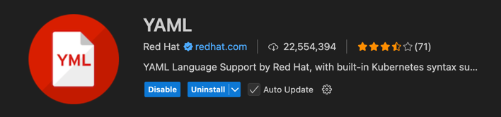

# ACS VS Code Schema Support

This VS Code extension provides YAML schema support for Agile Certificate Services (ACS) configuration files. 
It enables IntelliSense, validation, and autocompletion for the supported configuration files.

## Supported Configuration Files

*Note:* all configuration files must end with exact lower case match and end with .yml.
The structure of a configuration file is <name>.<type>.yml and the name must be the same
string value as in the 'name' field in the YAML file.

Name can have the characters 'a-z', 'A-Z', '0-9' and the '-','_' characters.

* CertificateProfile: <name>.certprofile.yml

Example: _test_profile.certprofile.yml_

## Prerequisites

Before using this extension, you must install the **YAML Extension by Red Hat**:

1. Open VS Code
2. Go to the Extensions view (Ctrl+Shift+X / Cmd+Shift+X)
3. Search for "YAML" and install the extension by Red Hat
4. Alternatively, install it from the command line: `code --install-extension redhat.vscode-yaml`



## Building the Extension

### 1. Install vsce (VS Code Extension Manager)

First, install the Visual Studio Code Extension Manager globally:

```bash
npm install -g @vscode/vsce
```

### 2. Install Dependencies

Install the project dependencies:

```bash
npm install
```

### 3. Build the Extension Package

Generate the `.vsix` package file:

```bash
vsce package
```

This will create a file named `acs-vscode-schema-support-0.0.1.vsix` in the root directory.

## Installing the Extension in VS Code

### Method 1: Using the Command Line

```bash
code --install-extension acs-vscode-schema-support-0.0.1.vsix
```

### Method 2: Using VS Code UI

1. Open VS Code
2. Go to the Extensions view (Ctrl+Shift+X / Cmd+Shift+X)
3. Click the three dots menu (`...`) in the Extensions view
4. Select "Install from VSIX..."
5. Browse and select the `acs-vscode-schema-support-0.0.1.vsix` file
6. Restart VS Code when prompted

## Features

- **Schema Validation**: Automatic validation of `*.certprofile.yml` files against X.509 certificate profile schemas
- **IntelliSense**: Code completion and suggestions for certificate configuration properties
- **Error Highlighting**: Real-time validation with error messages for invalid configurations
- **Documentation**: Hover tooltips with property descriptions and valid values

## Usage

Once installed, the extension automatically provides schema support for any file with the `.certprofile.yml` extension. The schema includes comprehensive validation for:

- Certificate subject fields and constraints
- X.509 certificate extensions (Basic Constraints, Key Usage, etc.)
- Subject Alternative Names with various field types
- Certificate policies and advanced extensions
- Cryptographic parameters and validity periods

## Development

### Build Commands

- `npm run compile` - Compile TypeScript to JavaScript
- `npm run watch` - Compile in watch mode for development
- `npm run lint` - Run ESLint on source files
- `npm run test` - Run extension tests
- `npm run vscode:prepublish` - Prepare for publishing

### Project Structure

- `src/extension.ts` - Main extension entry point
- `schemas/certificate-profile.schema.json` - JSON schema for certificate profiles
- `package.json` - Extension manifest and configuration

